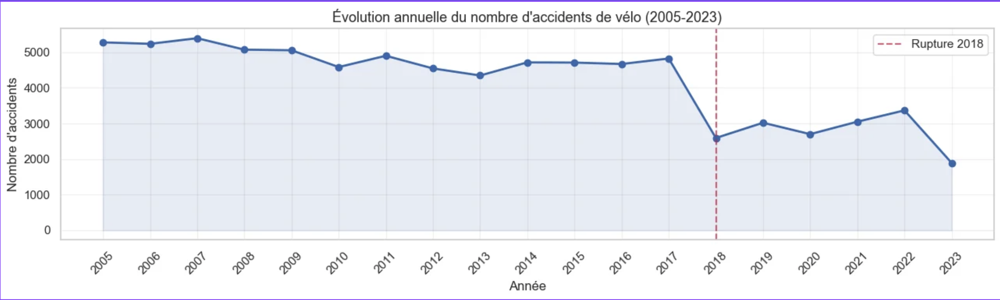
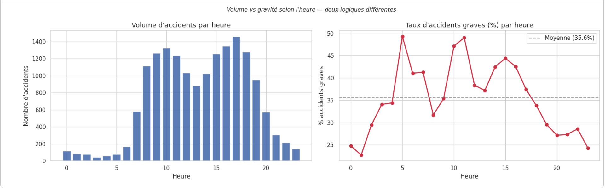
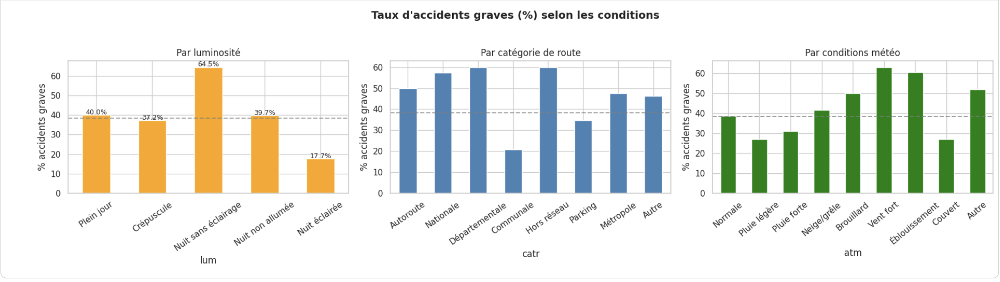
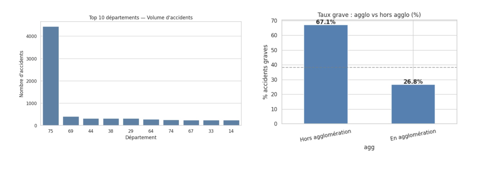
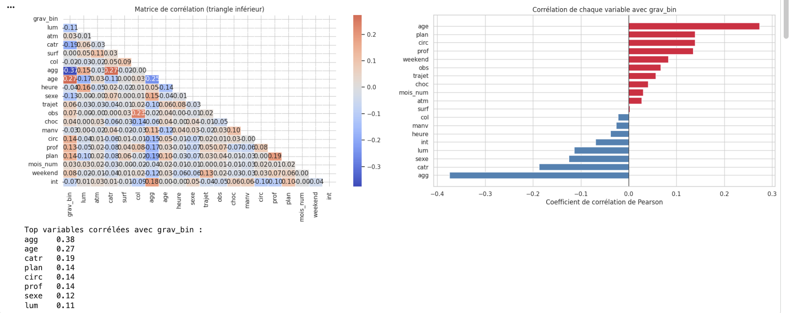
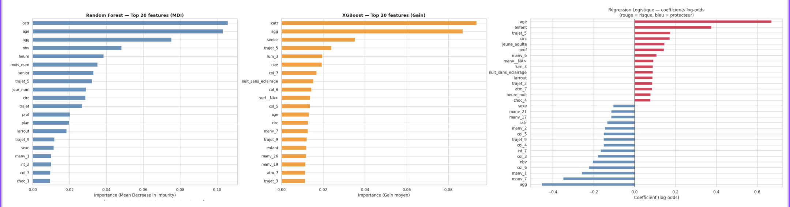
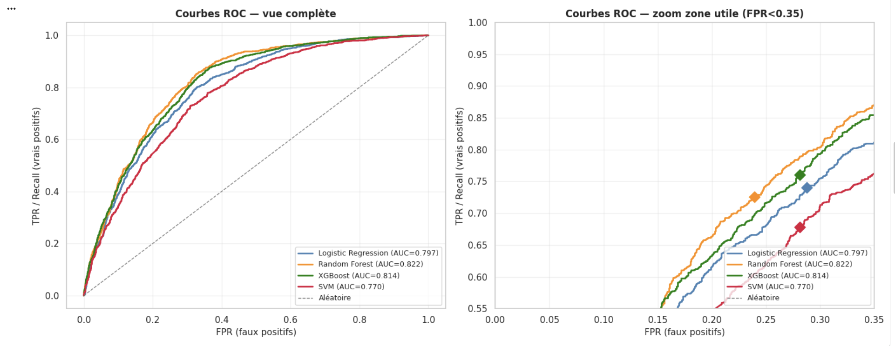
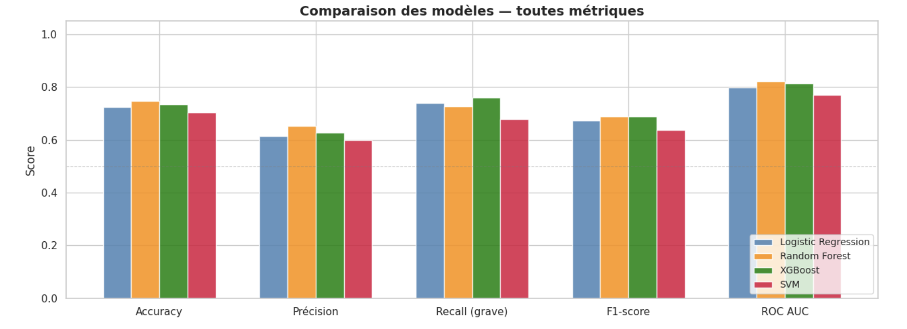
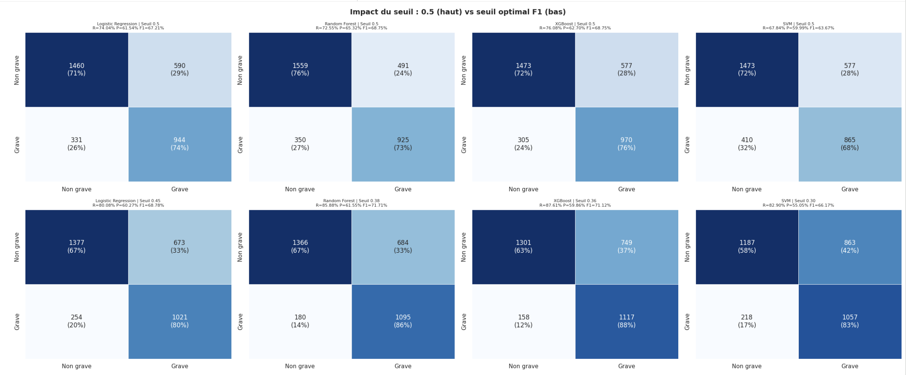

# Prédiction du Risque d'Accident Grave de Vélo en France

> Projet de Data Science appliqué à la sécurité routière — Pipeline ML complet sur +80 000 accidents réels

[](https://www.python.org/)
[](https://xgboost.readthedocs.io/)
[](https://scikit-learn.org/stable/modules/generated/sklearn.linear_model.LogisticRegression.html)
[](https://scikit-learn.org/stable/modules/svm.html)
[](https://scikit-learn.org/stable/modules/generated/sklearn.ensemble.RandomForestClassifier.html)
[](https://www.data.gouv.fr/datasets/accidents-de-velo)

---

## Objectif

Développer un pipeline de Machine Learning capable de **prédire la gravité d'un accident de vélo** à partir de variables contextuelles (météo, horaire, localisation, infrastructure routière).

**L’objectif principal** était de développer un pipeline complet capable de :

- analyser plus de **80 000 accidents de vélo** enregistrés en France ;
- identifier les facteurs les plus liés à la gravité des accidents ;
- prédire le risque d’accident grave à partir de variables contextuelles ;
- comparer plusieurs modèles de Machine Learning ;
- optimiser les performances dans un contexte de données volumineuses.
- Démontrer la capacité d’un pipeline ML à traiter des données réelles à grande échelle.
  
**Objectifs métier :**
- Mieux comprendre les contextes à risque pour les cyclistes ;
- Identifier les variables influençant les accidents graves ;
- Aider à prioriser les actions de prévention ;
---

## Dataset

| Caractéristique | Détail |
|---|---|
| Source | [Data.gouv.fr — Accidents corporels](https://www.data.gouv.fr/datasets/accidents-de-velo) |
| Période | 2005 → 2023 |
| Volume | +80 000 lignes |
| Type | Données multi-annuelles, météo, temporelles, géographiques |
| Quelques variables |luminosité (`lum`), météo (`atm`), sexe (`sexe`), heure (`hrmn`) ... |

**Variable cible (binaire) :**
- `0` → Accident léger
- `1` → Accident grave
---

## Pipeline Data Science
**Collecte → Nettoyage → EDA → Feature Engineering → Modélisation → Évaluation → Optimisation**

**1. Nettoyage des données**
- gestion des valeurs manquantes et incohérences ;
- harmonisation des variables ;
- transformation des types ;
- création de la variable cible binaire.

**2. Analyse Exploratoire des Données (EDA)**
L’EDA a permis d’identifier plusieurs tendances importantes.
- Les accidents augmentent fortement sur certaines plages horaires.
- Les accidents graves sont plus fréquents hors agglomération.
- Les conditions météorologiques influencent la gravité.
- Certains départements présentent des volumes très élevés.
- Les accidents graves sont minoritaires → problème de déséquilibre de classes.

**3. Feature engineering (saison, heure, département)** et - Traitement du déséquilibre de classes
  
**4. Entraînement et comparaison de 4 modèles ML**
- Optimisation mémoire et seuil de décision

---

## Modèles comparés

| Modèle | Notes |
|---|---|
| Logistic Regression | Baseline interprétable |
| Random Forest | Bonne robustesse, top feature importance |
| **XGBoost** | **Meilleur recall — modèle retenu** |
| SVM / LinearSVC | Comparaison scalabilité |

---
## 🎥 Présentation vidéo du projet

Une présentation de 06 minutes résumant le contexte, la démarche et les principaux résultats.

👉 [Voir la vidéo de présentation](https://www.canva.com/design/DAHKTgqJuaQ/5HF3ZWtyt6Y1H_Lo0KveOQ/view?utm_content=DAHKTgqJuaQ&utm_campaign=designshare&utm_medium=link2&utm_source=uniquelinks&utlId=hd1f0429750) 👈

---

## Visuels clés du projet
### 1. Évolution annuelle des accidents

- courbe annuelle des accidents 2005–2023.

### 2. Volume vs taux de gravité selon l’heure

Pourquoi c’est important :
- démontre la double lecture volume + dangerosité ;
- montre une vraie réflexion analytique.

### 3. Analyse météo / luminosité / surface

- les graphiques comparant les conditions de circulation

### 4. Top départements accidentogènes


### 5. Heatmap de corrélation

C’est un visuel très attendu dans un projet Data Science professionnel.

### 6. Feature Importance

- importance des variables Random Forest & XGBoost;
- coefficients Logistic Regression.

### 7. Courbes ROC

Pourquoi :
- montre la maîtrise de l’évaluation probabiliste ;
- visuel très professionnel.

### 8. Comparaison des modèles ML


### 9. Optimisation du seuil de décision

- matrices de confusion.

---
## Optimisations techniques & Solutions mises en place

- **Saturation RAM** : passage de SVM classique → LinearSVC pour réduire les coûts mémoire
- **Temps d’entraînement très longs** : Les modèles SVM classiques devenaient difficilement exploitables.
- **Traitement par batch** : optimisation des calculs sur gros volumes.
- **Ajustement du seuil de décision** : optimisation métier du Recall et F1-score.
- **Utilisation de TF-IDF optimisé** : réduction intelligente de la dimensionnalité.
  
---

## Résultats obtenus

Le modèle final permet :
- une détection robuste des accidents graves ;
- une bonne généralisation ;
- une interprétation claire des facteurs de risque.

Les résultats montrent notamment :
- l’importance des conditions de circulation ;
- l’impact de l’environnement routier ;
- le rôle des horaires et des zones géographiques.
  
---

## 🛠️ Stack technique

`Python` · `Pandas` · `NumPy` · `Scikit-learn` · `XGBoost` · `Random-Forest` · `SVM` · `Logistic-regression` · `Matplotlib` · `Seaborn` · `Jupyter Notebook`

---

## 📂 Structure du repo

```bash
accidents-velo-prediction
├── notebook.ipynb ← Pipeline complet
├── README.md
├── data/
│ └── readme.md ← Source et description du dataset
├── img/
│ └── .png ← Captures des résultats
```

---

## Compétences démontrées

- **Data Analysis** : EDA avancée, visualisation de données, analyse métier.
- **Machine Learning** : classification supervisée, tuning, optimisation de seuils, évaluation avancée.
- **NLP / Feature Engineering** : TF-IDF, préparation de variables, traitement haute dimension.
- **Data Engineering** : optimisation mémoire, gestion de volumétrie, pipeline robuste.
- **Communication Data** : storytelling analytique, restitution orientée métier, visualisations professionnelles.
  
---

## Ce que ce projet démontre

Au-delà du Machine Learning, ce projet démontre ma capacité à :
- structurer un projet Data Science complet ;
- travailler sur des données réelles volumineuses ;
- résoudre des contraintes techniques concrètes ;
- produire une analyse orientée décision métier ;
- expliquer clairement des résultats complexes.
  
---

## Auteur

**Cedric Kouokam** —  Data Analyst / Data Scientist

Machine Learning • NLP • Data Visualization • Business Analytics

[LinkedIn](https://www.linkedin.com/in/enzo-kamhoua/) · [GitHub](https://github.com/kenzo-kouokam)  · [Portfolio](https://kenzo-kouokam.github.io/cedric.kouokam/)  · [CV]()


